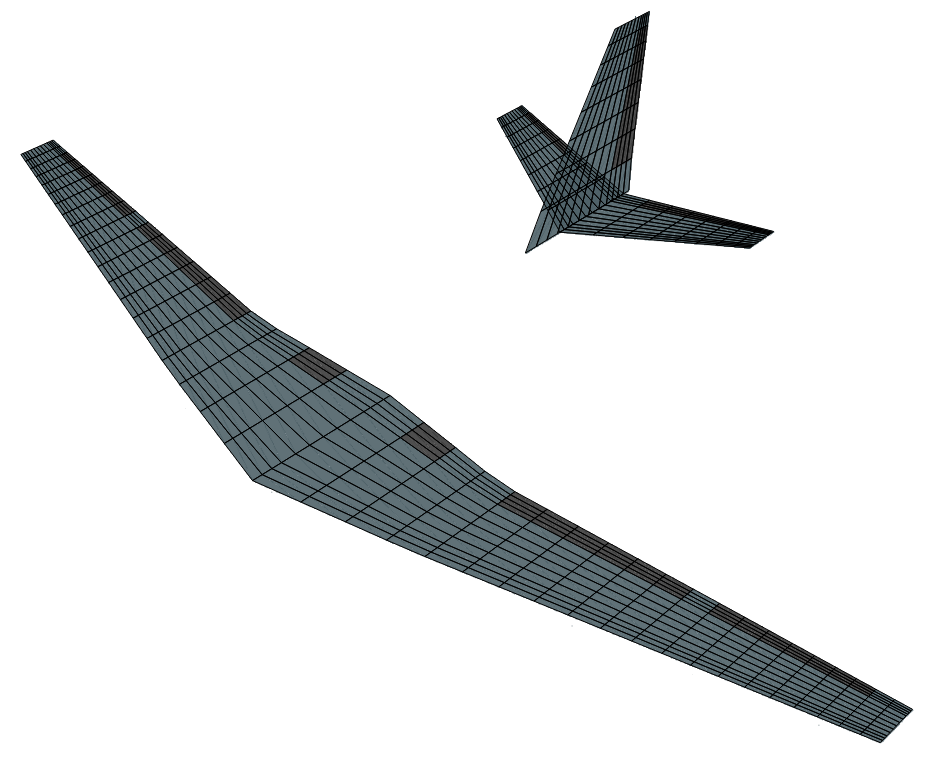

# AeroPanels.jl

[](https://github.com/Salmanxiii/AeroPanels.jl/actions/workflows/CI.yml?query=branch%3Amain)

**AeroPanels.jl** is a Julia library for continuous-time Unsteady Vortex Lattice Method (UVLM) aerodynamics [1][2], coupled 6-DOF rigid-body flight dynamics, structural load monitoring, and automated **FMI 2.0 Standard** Functional Mock-up Unit (FMU) export.

The package implements a continuous-time formulation of the UVLM:

$$\dot{\mathbf{\Gamma}}_w = \mathbf{f}(\mathbf{\Gamma}_w, \mathbf{x}, \mathbf{u}, t)$$

This enables continuous-time ODE integration (`DifferentialEquations.jl`), gradient tracing (`ForwardDiff.jl`), and direct co-simulation and model-exchange via FMI 2.0.

<p align="center">
  
</p>

---

## Key Features

- **Continuous-Time UVLM Aerodynamics**: High-efficiency 3D lifting-surface aerodynamics for steady (`SteadyAeroModel2D`) and continuous unsteady (`UnsteadyAeroModel2D`) flow conditions.
- **Coupled 6-DOF Flight Dynamics**: Integrated 6-DOF rigid body equations of motion (`RigidBody6DOF` / `UnsteadyFlightDynamics`) coupled with continuous aerodynamic force and moment generation.
- **FMI 2.0 Standard Co-Simulation Export**: Automated export of models to FMI 2.0 Co-Simulation FMUs (`BuildFMU`) for integration into **MATLAB / Simulink**, **Python e.t.c**.
- **Discrete Gust & Load Factor Analysis**: Continuous-time 1-cosine vertical gust disturbance simulations ($L_g$, $U_{ds}$) and structural load monitoring (`MonitorPoint`) for load factor ($n_z$), wing-root shear force ($SF$), and bending moment ($BM$).

---

## Step-by-Step Workflow & Usage

### 1. Define Aerodynamic Geometry
Create 2D lifting surfaces (`AeroSurface2D`) by specifying chord, span, sweep, and origin, then mirror across the symmetry plane (`MakeSymmetricY`):

```julia
using AeroPanels
using StaticArrays

stbd_wing = AeroSurface2D(10, 15;
    chord = [2.0, 1.0],         # Root and tip chord (m)
    span = 6.0,                 # Semi-span (m)
    sweep = deg2rad(10.0),       # Leading-edge sweep angle
    dihedral = deg2rad(2.0),    # Dihedral angle
    origin = [0.0, 0.0, 0.0]    # Root origin
)
full_wing = MakeSymmetricY(stbd_wing)

# Reference dimensions (chord, span, area)
props = AeroModelProperties(c = 1.5, b = 12.0, S = 18.0)
```

### 2. Build the Bound Mesh
Combine the surfaces into a bound surface mesh (`ThinAeroMesh`):

```julia
bound_mesh = ThinAeroMesh(full_wing)
```

### 3. Attach the Fixed Wake Grid
Create the trailing-edge wake mesh (`FixedWakeMesh`) specifying the number of wake panels (`nWake`) and wake length. Creating a wake mesh with 40 panels in wake direction and length 15 times the chord length

```julia
wake_mesh = FixedWakeMesh(bound_mesh.ringMesh, bound_mesh.sizes, props; nWake = 40, wakeLength = 15.0)
```

### 4. Define Control Surfaces
Define control surface deflection regions (`ControlSurface`) on specific chordwise (`nc`) and spanwise (`ns`) panel indices:

```julia
aileron = CreateControlSurface(bound_mesh, "StarboardAileron", surfaceIdx = 1, nc = (8, 10), ns = (10, 15))
control_surfaces = [aileron]
```

### 5. Define Load Monitor Points
Define structural load integration locations (`MonitorPoint`) for wing-root load monitoring:

```julia
mp_origin = SA[0.375, 0.0, 0.0] # 25% root chord
wing_root_mp = CreateMonitorPoint(bound_mesh, "WingRootLoad", surfaceIdx = 1, nc = (1, 10), ns = (1, 15), origin = mp_origin)
monitor_points = [wing_root_mp]
```

### 6. Construct Aerodynamic & Flight Dynamics Models
Assemble the continuous-time unsteady aerodynamic model (`UnsteadyAeroModel2D`) and wrap it with 6-DOF rigid body kinematics (`RigidBody6DOF`):

```julia
aero_model = UnsteadyAeroModel2D(bound_mesh, wake_mesh, props, 1.0;
    controlSurfaces = control_surfaces,
    monitorPoints = monitor_points
)

mass = 1200.0 # Aircraft mass (kg)
inertia = @SMatrix [
    1500.0    0.0     0.0;
       0.0 2500.0     0.0;
       0.0    0.0  3500.0
]
flight_model = RigidBody6DOF(aero_model, mass, inertia)
```

### 7. Export to FMI 2.0 Standard FMU
Export the assembled model into an FMI 2.0 Co-Simulation Functional Mock-up Unit (`.fmu`) using `BuildFMU`:

```julia
fmu_path = BuildFMU(flight_model, @__DIR__; fmu_name = "CustomWingFMU")
```

---

## Repository Structure

- `src/Geometry/`: Surface geometry (`AeroSurface2D`), meshing (`ThinAeroMesh`), fixed wake grids (`FixedWakeMesh`), control surfaces, and monitor points.
- `src/Models/`: Continuous-time steady/unsteady aerodynamic solvers (`SteadyVLM.jl`, `UnsteadyVLM.jl`) and 6-DOF rigid body dynamics (`RigidBody6DOF.jl`).
- `src/Interfaces/`: FMU Model construction Interface.
- `ext/FMI/`: C-code generation and XML `modelDescription.xml` generator for FMI 2.0 compliance.


---

## References

1. M. Mohammadi-Amin, B. Ghadiri, M. M. Abdalla, H. Haddadpour, R. De Breuker, *Continuous-time state-space unsteady aerodynamic modeling based on boundary element method*, Engineering Analysis with Boundary Elements 36 (5) (2012) 789–798. [doi:10.1016/j.enganabound.2011.12.007](https://doi.org/10.1016/j.enganabound.2011.12.007).
2. S. Binder, A. Wildschek, R. De Breuker, *Extension of the continuous time unsteady vortex lattice method for arbitrary motion, control surface deflection and induced drag calculation*, in: 17th International Forum on Aeroelasticity and Structural Dynamics (IFASD 2017), Como, Italy, 2017.

---

## License

This package is licensed under the MIT License.
