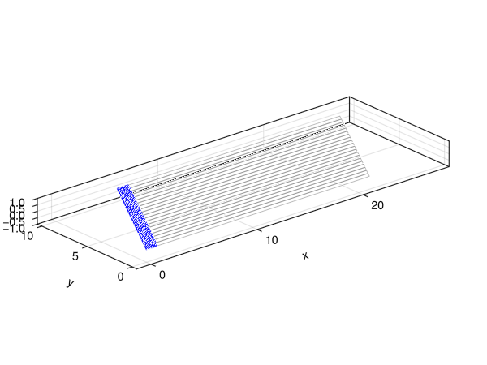
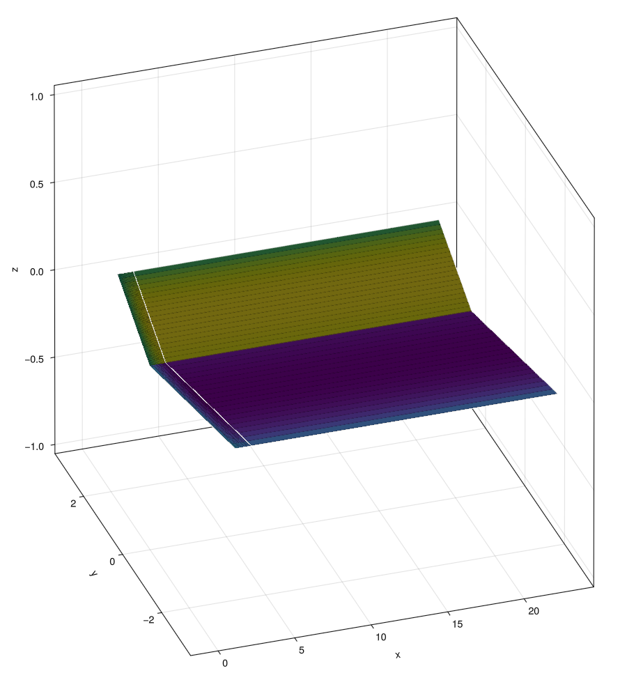
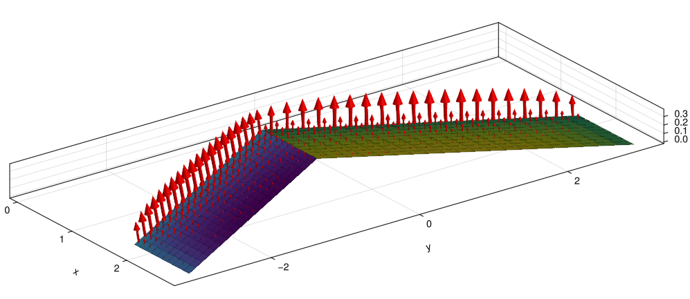

# Examples

This section provides examples of how to use AeroPanels.jl for both steady and unsteady aerodynamic simulations.

## Steady-State Analysis

To solve for the steady lift and drag of a wing:

```julia
using AeroPanels
using StaticArrays

# 1. Define Geometry
nc, ns = 10, 20
chord = (1.0, 1.0)
span = 10.0
surf = AeroSurface2D(nc, ns, chord=chord, span=span)

# 2. Set Model Properties
props = AeroModelProperties(c=1.0, b=span, S=span*1.0)

# 3. Create Model
model = AeroModel2D([surf], props)

# 4. Solve
V, α = 10.0, 5.0 # Speed [m/s], AoA [deg]
sol = AeroSolve(V, α, model)

println("Lift Coefficient (CL): ", sol.CL)
println("Drag Coefficient (CD): ", sol.CD)
```

## Unsteady Simulation (Wagner Problem)

Simulating the lift buildup following a sudden acceleration:

```julia
using AeroPanels
using OrdinaryDiffEq
using StaticArrays

# 1. Define Model
c, V, α = 1.0, 1.0, 2.0
surf = AeroSurface2D(10, 1, chord=(c, c), span=100.0) # 2D approx
props = AeroModelProperties(c=c, b=100.0, S=100.0)
model = UnsteadyAeroModel2D([surf], props, V, nWake=100)

# 2. Dynamics Equation
b = NormalWash(SVector(V*cos(deg2rad(α)), 0.0, V*sin(deg2rad(α))), model)
u0 = zeros(NumberOfStates(model))
tspan = (0.0, 20.0)

function uvlm_dynamics!(du, u, p, t)
    du .= SolveCirculation(u, b, model)
end

# 3. Integrate
prob = ODEProblem(uvlm_dynamics!, u0, tspan)
sol = solve(prob, RK4())

# 4. Calculate Forces at final time
Fa, Fu = SolveForces(sol.u[end], SVector(V, 0., 0.), SVector(0., 0., 0.), model)
```

## Visualization

AeroPanels.jl includes a Makie extension for visualizing aerodynamic models. To use it, simply load `GLMakie` (or another Makie backend) alongside `AeroPanels`.

```julia
using AeroPanels
using GLMakie
using StaticArrays

# 1. Define Swept Wing Geometry
nc, ns = 10, 20
chord = (1.0, 1.0)
span = 10.0
sweep_angle = deg2rad(30)
surf = AeroSurface2D(nc, ns, chord=chord, span=span, sweep=sweep_angle)
surf2 = Mirror(surf,2)

# 2. Set Model Properties
props = AeroModelProperties(c=1.0, b=span, S=span*1.0)

# 3. Create Model
model = AeroModel2D([surf, surf2], props)

# 3. Solve
V, α = 10.0, 5.0 # Speed [m/s], AoA [deg]
vb = AeroPanels.BodyVelocity(V, deg2rad(α))
b = AeroPanels.NormalWash(vb, model)
Γp, Γw, Γs = AeroPanels.Circulation(b, model)
Fa = AeroPanels.AerodynamicForce(Γp, Γw, Γs, vb, model, ρ=1.225)
sol = AeroPanels.SteadySolution(Fa, vb, model, 1.225)

# --- Plotting ---

# Plot mesh only
fig1 = PlotModel(model)

```

### Visual Examples

**Mesh and Wake**


```julia
# Plot with circulation colormap (constant color per panel)
fig3 = PlotModel(model, plotWake=true, Γp=Γp, Γw=Γw)
```

**Panel and Wake Circulation**


```julia
# Plot forces (wake hidden for better vector visibility)
fig4 = PlotModel(model, plotWake=false, Γp=Γp, Γw=Γw, plotForces=true, sol=sol, forceScale=0.05)
```

**Aerodynamic Forces**

