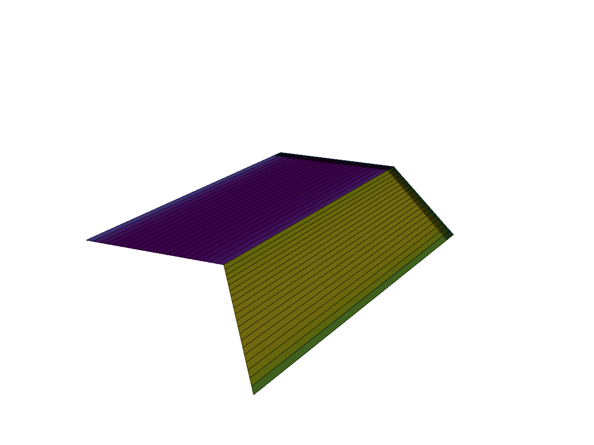

```@meta
CurrentModule = AeroPanels
```

# AeroPanels.jl

*A fast, continuous-time Unsteady Vortex Lattice Method (UVLM) solver written in Julia.*

Documentation for [AeroPanels.jl](https://github.com/Salmanxiii/AeroPanels.jl).

AeroPanels.jl is a potential flow aerodynamic solver designed for high-performance and seamless integration with continuous-time simulations like aeroelastic flutter and flight dynamics. It provides both a traditional steady-state solver and an advanced unsteady continuous-time state-space formulation with automated **FMI 2.0 Standard** FMU export.



## Quick Start: Steady Wing Analysis

Here is a simple example showing how to create a wing surface, generate its bound and wake meshes, and solve for the steady aerodynamic forces (Lift and Drag).

```julia
using AeroPanels
using StaticArrays

# 1. Define the Wing Geometry (e.g., a simple 30° swept wing)
nc, ns = 10, 20
chord = (1.0, 1.0)
span = 10.0
sweep_angle = deg2rad(30.0)
surf = AeroSurface2D(nc, ns, chord=chord, span=span, sweep=sweep_angle)

# 2. Set Reference Model Properties
props = AeroModelProperties(c=1.0, b=span, S=span*1.0)

# 3. Assemble Bound Mesh & Fixed Wake Grid
bound_mesh = ThinAeroMesh(surf)
wake_mesh = FixedWakeMesh(bound_mesh.ringMesh, bound_mesh.sizes, props)

# 4. Construct Steady Aerodynamic Model
model = SteadyAeroModel2D(bound_mesh, wake_mesh, props)

# 5. Define Flight Condition & Solve
V = 10.0   # Freestream speed [m/s]
α = 5.0    # Angle of attack [deg]
ρ = 1.225  # Air density [kg/m^3]

vb = AeroPanels.BodyVelocity(V, deg2rad(α))
cache = AeroSolve(vb, model, ρ)

# 6. Extract Results
CFstab, CMstab = GetStabilityCoefficients(cache, vb, ρ, model)
println("Lift Coefficient (CL): ", round(-CFstab[3], digits=4))
println("Drag Coefficient (CD): ", round(-CFstab[1], digits=4))
```

### Next Steps

- Read the [Steady Theory](steady_theory.md) and [Unsteady Theory](unsteady_theory.md) pages to understand the continuous-time mathematical formulation.
- Check out the Examples page for more advanced usage, including unsteady Wagner problem simulations and coupled 6-DOF flight dynamics.
- Browse the [API Reference](api.md) for detailed function documentation.

```@index
```
