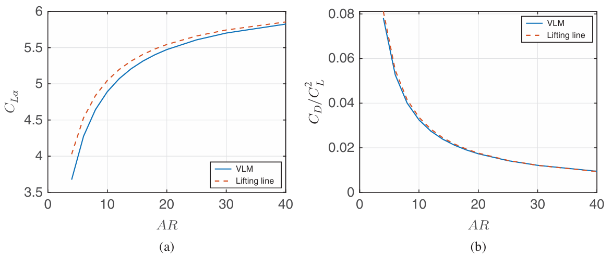
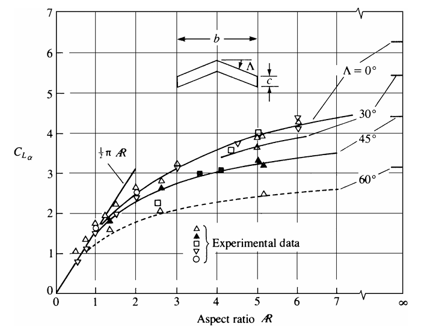
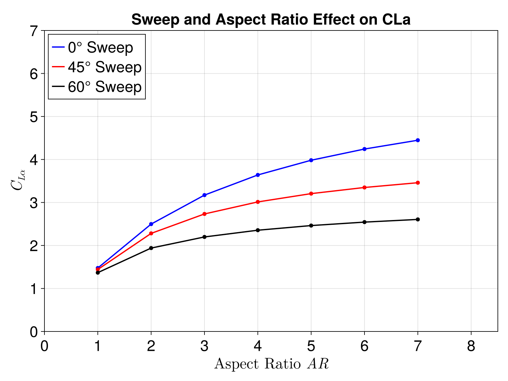

# Steady Aerodynamics Theory

The steady-state solver is based on a standard 3D Vortex Lattice Method. Lifting surfaces are discretized into a grid of panels, each containing a closed vortex ring element.

### Induced Velocity
Each vortex ring from the body panels and the trailing wake induces a velocity field in the surrounding fluid. The total induced velocity $\vec{V}_p$ at any arbitrary point $p$ in space can be expressed compactly in vector form as:

$$\vec{V}_p = [AIC3_p]\{\Gamma_p\} + [AIC3_w]\{\Gamma_w\}$$

where:
-  $[AIC3_p]$ is the 3D Aerodynamic Influence Coefficient matrix for the body panels. Each column represents the vector velocity induced at point $p$ by a unit vortex strength on a specific body panel.
-  $[AIC3_w]$ is the 3D Aerodynamic Influence Coefficient matrix for the wake panels.
-  $\{\Gamma_p\}$ are the circulation strengths of the body panel vortex rings.
-  $\{\Gamma_w\}$ are the circulation strengths of the wake vortex rings.

### Permeability Condition
The fundamental physical constraint is the impermeability (or non-penetration) condition, which states that there can be no flow through the solid lifting surface. At any point on the surface with a local normal vector $\vec{n}$, the normal component of the total fluid velocity must exactly match the normal component of the body's kinematic velocity $\vec{v}_b$ (which includes both freestream and structural motion):

$$(\vec{V}_p + \vec{v}_b) \cdot \vec{n} = 0$$

Substituting the expression for the induced velocity, the permeability condition becomes:

$$\left( [AIC3_p]\{\Gamma_p\} + [AIC3_w]\{\Gamma_w\} \right) \cdot \vec{n} = -\vec{v}_b \cdot \vec{n}$$

### Governing Equation
To solve for the unknown vortex strengths $\{\Gamma_p\}$, the continuous permeability condition must be enforced at a discrete set of locations. In the Vortex Lattice Method, this condition is enforced at the collocation (or control) points of each body panel, which are typically located at 75% of the panel's local chord.

Evaluating the permeability condition at all $N$ collocation points yields a square linear system of equations:

$$[AIC]\{\Gamma_p\} + [AIC_{wake}]\{\Gamma_w\} = \{b\}$$

where:
-  $[AIC]$ is the normal wash influence matrix of the body panels, calculated as $[AIC3_p] \cdot \vec{n}$ at the collocation points.
-  $[AIC_{wake}]$ is the normal wash influence matrix of the wake panels, calculated as $[AIC3_w] \cdot \vec{n}$ at the collocation points.
-  $\{b\}$ is the normal wash boundary condition vector, defined as $b_i = -\vec{v}_{b,i} \cdot \vec{n}_i$.

### Kutta Condition
The Kutta condition ensures that the flow leaves the trailing edge smoothly. In AeroPanels.jl, this is satisfied implicitly by the inclusion of the wake. In the steady case, the wake is modeled as a set of flat, semi-infinite vortex rings extending downstream from the trailing edge.

Because the steady wake circulation $\Gamma_w$ is equal to the circulation of the corresponding trailing edge (TE) panel $\Gamma_{TE}$, the influence of the wake can be folded directly into the body's influence matrix. The $[AIC_{wake}]$ columns are added to the corresponding trailing edge columns of the $[AIC]$ matrix:

$$AIC_{TE} = AIC_{body, TE} + AIC_{wake}$$

This substitution implicitly enforces the Kutta condition and simplifies the governing equation into a solvable linear system for the unknown panel circulations:

$$[AIC]\{\Gamma_p\} = \{b\}$$

### Steady Force Computation
The aerodynamic forces on each panel segment are computed using the Kutta-Joukowski theorem. A key difference between some literature approaches and our implementation is that **we explicitly include the induced velocity effect**.

The force $\vec{F}_i$ on a segment $i$ is calculated as:

$$\vec{F}_i = \rho \Gamma_{s,i} (\vec{V}_i + \vec{v}_b) \times \vec{r}_i$$

where:
-  $\rho$ is the air density.
-  $\Gamma_{s,i}$ is the circulation of segment $i$.
-  $\vec{r}_i$ is the segment vector.
-  $\vec{v}_b$ is the body velocity.
-  $\vec{V}_i$ is the **induced velocity** at the segment, computed explicitly from the influence of all other rings and the wake:

$$\vec{V}_i = [AIC3_p]\{\Gamma_p\} + [AIC3_w]\{\Gamma_w\}$$

---

## Verification

The steady solver has been validated against data from Plotkin and Dimitriadis for swept wings and induced drag predictions.

### Induced Drag Validation
The solver's prediction for induced drag across different aspect ratios and sweep angles is compared against classical aerodynamic data from Dimitriadis.

**Reference Data (Dimitriadis)**

**AeroPanels.jl Results**

### Swept Wing Validation
The sectional lift distribution over swept wings is validated against Plotkin's data.

**Reference Data (Plotkin)**

**AeroPanels.jl Results**
