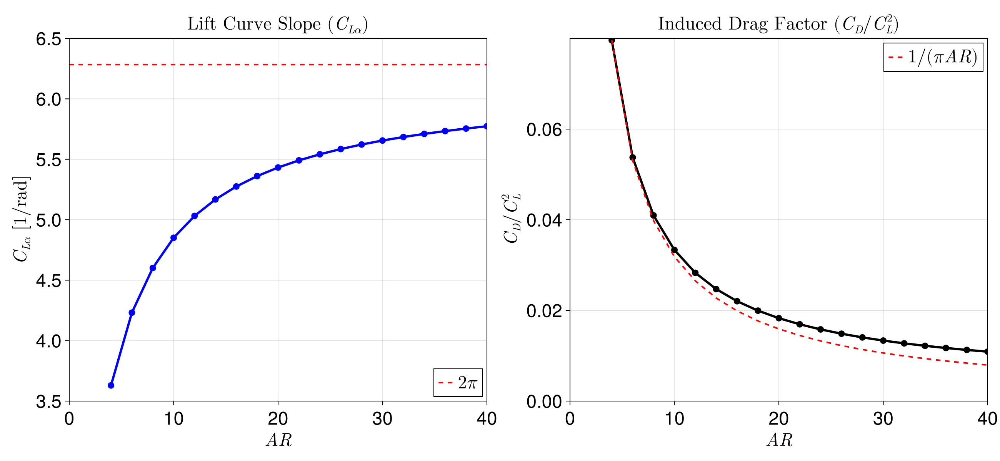

# Theory

AeroPanels.jl implements potential flow aerodynamic models using the Vortex Lattice Method (VLM) for both steady and unsteady flows.

## Steady Aerodynamics

The steady-state solver is based on a standard 3D Vortex Lattice Method implementation. Lifting surfaces are discretized into a grid of panels, each containing a closed vortex ring (vortex ring elements). 

### Boundary Condition
The non-penetration (flow tangency) condition is enforced at the collocation points (typically at 75% chord). For a system of $N$ panels, this leads to a linear system of equations:

$$[AIC]\{\Gamma\} = -\{\vec{V}_\infty \cdot \vec{n}\}$$

where $[AIC]$ is the Aerodynamic Influence Coefficient matrix, $\{\Gamma\}$ are the unknown vortex strengths, and $\{\vec{V}_\infty \cdot \vec{n}\}$ is the normal wash due to the freestream velocity.

### Kutta Condition
The Kutta condition is satisfied by including a wake that trails from the trailing edge. In the steady case, the wake is modeled as a set of flat vortex rings extending to infinity.

---

## Unsteady Aerodynamics

The unsteady solver implements a **Continuous-Time Unsteady Vortex Lattice Method (UVLM)**. Unlike traditional discrete-time models that use a fixed time step, this approach formulates the aerodynamics as a continuous-time state-space system.

### Governing Equations
The model is derived from the transport of vorticity in the wake. As described in Binder (2017) and Werter et al. (2018), the system is expressed as:

$$\dot{\{\Gamma_w\}} = [K_8]\{\Gamma_w\} + [K_9]\{b\}$$

where:
-  $\{\Gamma_w\}$ are the wake circulation states.
-  $\{b\}$ is the normal wash vector (boundary condition).
-  $[K_8]$ represents the transport of vorticity through the wake.
-  $[K_9]$ represents the shedding of new vorticity from the trailing edge.

### Force Computation
The aerodynamic forces are calculated using the unsteady Bernoulli equation and the Kutta-Joukowski theorem, decomposed into:
1.  **Quasi-steady forces**: Due to the local circulation and velocity.
2.  **Unsteady forces (Added Mass)**: Due to the time derivative of the circulation ($\dot{\Gamma}$).

This continuous-time formulation allows for:
- Integration with standard ODE solvers (e.g., `OrdinaryDiffEq.jl`).
- Variable time-stepping.
- Direct linearization for stability and aeroelastic analysis.

## Verification

The methods implemented in this package have been verified against classical analytical solutions.

### Wagner Problem (Sudden Acceleration)
The unsteady lift buildup on a flat plate following an impulsive start is compared against the Wagner function.

### Steady Sweep and Drag
The steady solver has been validated against data from Plotkin and Dimitriadis for swept wings and induced drag predictions.

