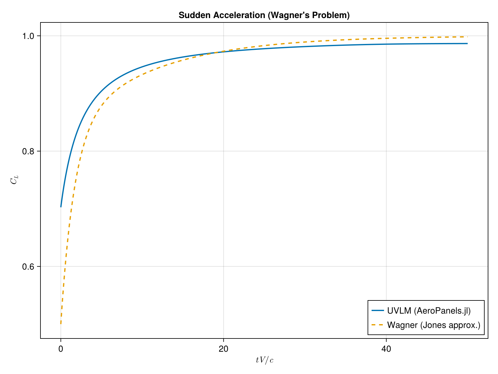

# Unsteady Aerodynamics Theory

The unsteady solver implements a **Continuous-Time Unsteady Vortex Lattice Method (UVLM)**. Unlike traditional discrete-time models that use a fixed time step, this approach formulates the aerodynamics as a continuous-time state-space system, which is well-suited for integration with standard ODE solvers and aeroelastic analysis.

### Governing Equations
The unsteady model is derived from the transport of vorticity in the wake. Based on the formulations in continuous UVLM literature (e.g., Binder 2017, Werter et al. 2018), the aerodynamic state can be represented by the wake circulation states $\{\Gamma_w\}$, which evolve according to the transport equation:

$$\dot{\{\Gamma_w\}} = [K_8]\{\Gamma_w\} + [K_9]\{b\}$$

where:
-  $\{\Gamma_w\}$ are the wake circulation states (the state vector of the system).
-  $\{b\}$ is the normal wash vector (the input vector).
-  $[K_8]$ represents the transport (convection) of vorticity through the wake.
-  $[K_9]$ represents the shedding of new vorticity from the trailing edge due to changes in the boundary condition.

The body circulations $\{\Gamma_b\}$ are then recovered from the wake states and the boundary condition using steady-like relations mapping matrix operators:

$$\{\Gamma_b\} = [L_3]\{\Gamma_w\} - [L_4]\{b\}$$

### Unsteady Force Computation
The total aerodynamic forces in the unsteady model are calculated using the unsteady Bernoulli equation, decomposed into two main components:

1.  **Quasi-steady forces (Circulatory)**: These are computed identically to the steady case, using the Kutta-Joukowski theorem on the segments, but utilizing the instantaneous body and wake circulations ($\{\Gamma_b\}$ and $\{\Gamma_w\}$). Crucially, **the induced velocity effect is included** in this calculation as well:

$$\vec{F}_{qs,i} = \rho \Gamma_{s,i} (\vec{V}_i + \vec{v}_b) \times \vec{r}_i$$

2.  **Unsteady forces (Added Mass / Non-circulatory)**: These arise from the time rate of change of the potential field (or circulation) over the panels. For a panel $i$ with area $A_i$ and normal $\vec{n}_i$, the unsteady force is:

$$\vec{F}_{u,i} = \rho \dot{\Gamma}_{b,i} A_i \vec{n}_i$$

The derivative of the body circulation $\dot{\Gamma}_b$ is computed analytically from the state-space matrices:

$$\dot{\{\Gamma_b\}} = [L_5]\{\Gamma_w\} + [L_6]\{b\} - [L_4]\{\dot{b}\}$$

where $\{\dot{b}\}$ accounts for the fluid's acceleration or pitch-rate changes.

By combining the quasi-steady and unsteady force components, the complete dynamic loads on the lifting surfaces are obtained.

---

## Verification

The unsteady methods implemented in this package have been verified against classical analytical solutions.

### Wagner Problem (Sudden Acceleration)
The unsteady lift buildup on a flat plate following an impulsive start is compared against the analytical Wagner function.

